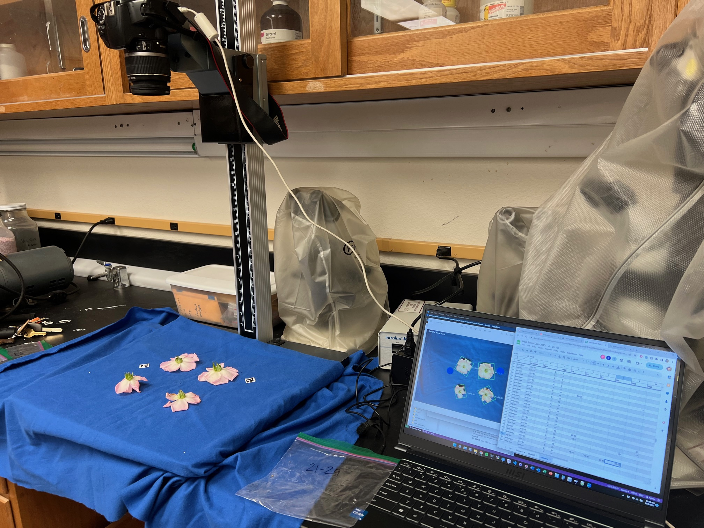
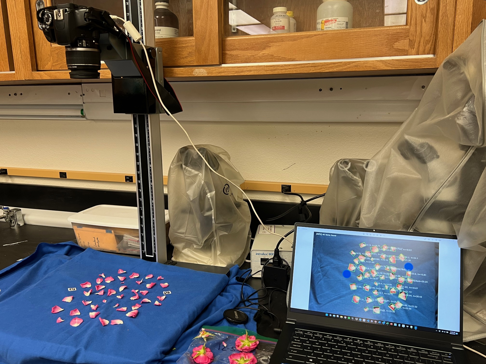
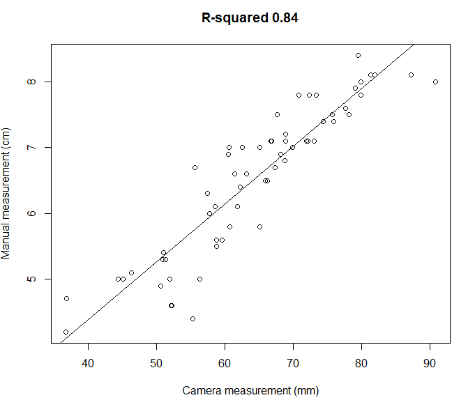

# petal_counter
image analysis pipeline for counting petals and flower size


## Description
This pipeline is optimized for lighting conditions on the back bench of lab 423. To run script you need to have digicamcontrol installed, python, opencv and a windows computer. Detailed instructions below. 


# Dependencies
- Windows operating system
- digiCamControl (open source digital DSLR controlling software) [link to website](https://digicamcontrol.com/) check their website for [compatible camera models](https://digicamcontrol.com/cameras).  
- R with dependencies (ggplot2, ggpubr, knitr, gridExtra, magick)
```
# install with these following line
install. packages(c("ggplot2", "ggpubr,"knitr","gridExtra","magick"))
```
- python with dependencies (imutils, skimage, cv2, numpy, scipy)
```
# install with the following line
pip install imutils skimage opencv scikit-image opencv-python numpy scipy
```

## The pipeline
- clone the repository
- open the code folder
- double click the take_photo_count.bat


## Examples


